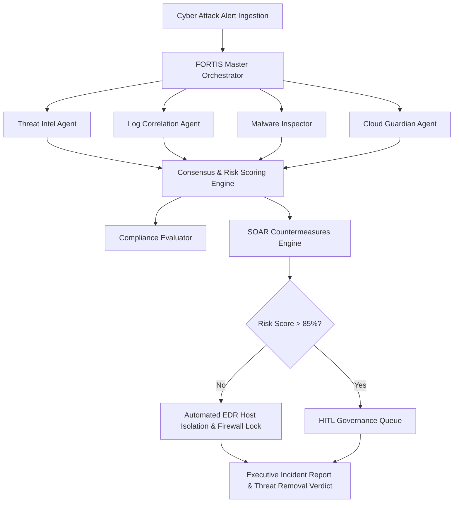

# 🛡️ FORTIS — Autonomous Multi-Agent SOC Intelligence Platform

> **FORTIS** is an enterprise-grade, real-time autonomous Multi-Agent Security Operations Center (SOC) platform designed to ingest high-severity alert telemetry, decompose complex cyber incidents, execute automated SOAR containment playbooks, and generate executive breach reports with explicit Threat Neutralization Verdicts.

---

## ✨ Features

- **🛡️ 8 Specialized Autonomous Agents**:
  1. **FORTIS Master Orchestrator (SOC Coordinator)** — Decomposes complex alerts into sub-tasks and synthesizes consensus.
  2. **Threat Intelligence Agent** — Queries VirusTotal, AbuseIPDB, and Shodan APIs for IP and hash reputation scoring.
  3. **Log Correlation Agent** — SIEM pattern matching using Sigma rules.
  4. **Malware Inspector** — Static YARA signature scanning and memory entropy evaluation.
  5. **Cloud Guardian Agent** — AWS IAM, CloudTrail, and GCP audit analyzer.
  6. **SOAR Countermeasures Engine** — Automated host isolation, edge firewall rule creation, and OAuth token revocation.
  7. **Compliance Evaluator** — Assesses regulatory impacts (GDPR Art. 33, PCI-DSS CDE).
  8. **HITL Guardrail Agent** — Enforces Human-in-the-Loop approval for high-risk containment actions (Risk Score > 85%).

- **🔥 Cyber Attack Simulator Console**:
  - Interactive attack injection with customizable Target Asset Host, Attacker Source IP, and execution speed.
  - Threat vectors including APT29 Ransomware & Data Exfiltration, Cloud IAM Access Key Hijacking, and LSASS Credential Dumping.

- **⚡ HTML5 Canvas Attack Vector Visualizer**:
  - Dynamic node packet animation connecting Attacker, Firewall, Target Endpoint, and Data Vault nodes.
  - Active animation streaming during execution, settling into a protected shield state upon mitigation.

- **🔍 Expandable Telemetry Drawers**:
  - Clean log streams with `Show Technical Telemetry ▼` drawers exposing raw JSON tool payloads.

- **📄 Executive Incident Report Generator**:
  - Professional, PDF-ready executive incident report with prominent **THREAT REMOVAL VERDICT: SUCCESSFUL MITIGATION** banner, Indicators of Compromise (IoCs) table, and MITRE ATT&CK technique mapping.

---

## 🚀 Getting Started

### Prerequisites
- Any modern web browser (Chrome, Firefox, Edge, Safari).
- Python 3.x (or any local static HTTP server).

### Installation & Launch

1. **Clone the repository:**
   ```bash
   git clone https://github.com/THEPUCHU/s-o-c.git
   cd s-o-c
   ```

2. **Launch the web application:**
   ```bash
   python -m http.server 8100
   ```

3. **Open in browser:**
   Navigate to `http://localhost:8100/`

---

## 📸 Architecture



---

## 📜 License
MIT License. Developed for Advanced Security Operations Centers and Autonomous Agent Hackathons.
